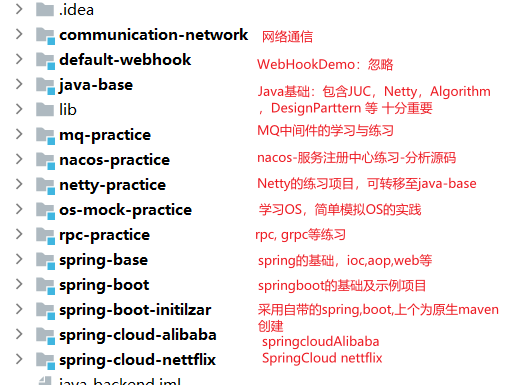

# java-backend
learn and practice of java backend,such as javabase,spring,rpc and so on

## 一、项目介绍

>该项目为个人学习Java后端知识的练习及总结项目,包含Java的基础语法、设计模式以及Spring框架、分布式等系列知识。

## 二、目录介绍

---
## 三、学习路线

### 计算机基础

1. 计算机组成及数电、模电（2022.09-2022.11）

- 认识计算机系统组成构成（硬件+软件）

- 认识数据、信息如何在计算机通过数字系统表示（二进制）

- 认识存储（存储器的层次及原理）、缓存，解决数据的存储、保存

- 认识计算（指令系统、CPU的组成和原理）

- 认识计算机内部的通信（寻址、总线、IO）

推荐：
（1）CSAPP 深入理解计算机系统：比较全面地介绍了计算机系统的构成、程序如何运行及通信，进阶好书
（2）麻省理工学院机组网课：从信息、数据、数电基础到存储、CPU等讲解，比较基础、全面
（3）计算机组成：硬件、软件接口：更加详细地介绍软件和硬件的组成

2. 操作系统（2022.09-2022.11）

- 认识操作系统的概念和作用

- 学习并发化：进程、线程管理，状态机、死锁、锁、信号量。可结合Java的并发学习，涉及内存模型管理（一致性问题，分布式）

- 学习虚拟化技术：内存管理、虚存、缓存，可结合机组的存储部分

- 学习持久化技术：文件管理、磁盘管理

- 学完之后，可深入分析JVM和MSYQL的体系结构设计和原理

推荐：
（1）JYY南大网课
（2）现代操作系统
（3）学完之后，可进行Linux相关的深入学习，例如Unix经典入门、深入LInux

3. 数据库（2022.10-2022.12）

- 学习数据库的概念和作用（关系代数、数据库模型等）

- 学习SQL的基本使用和高级使用、过程式存储SQL

- 学习数据库的表、模型设计，了解相关的设计范式

- 数据仓库，学习了解常用的数据库
非关系型：Redis、MongoDB、Memcached
关系型：MYSQL、Oracle
大数据相关的存储：HDFS、

- 学习MYSQL：深入MYSQL的执行引擎、体系结构（SQL的解析，优化等）、性能与优化

推荐
（1）数据库概论
（2）高性能MYSQL

4. 计算机网络（2022.10-2022.12）
- 学习基本的网络模型，通信的过程
- 掌握并熟悉TCP、IP，HTTP
- 清楚网络的连接过程，理解cookie、session等作用

推荐
（1）网络是怎么连接的
（2）计算机网络基础（谢希仁）
（3）计算机网络：自顶向下
（4）HTTP权威指南
（5）Unix编程
学习时，可结合Java的通信框架以及C/S模型的设计

5. 数据结构与算法（2022.10-2022.12）

6. 编译系统（暂放）

7. 软件工程（暂放）

- 软工基础

### Java及相关技术

1.语言及原理基础

- 基本语法
- JVM

2.设计方面

- 设计模式
- DDD领域设计
- 重构
- 其他常见架构设计原则

3. 框架
- Tomcat及源码分析
- Spring系列

4. 中间件
- MQ类（RocketMQ、Kafka）
- 搜索类（ES）
- 分布式类

5. 容器、运维

- Linux及shell
- Docker及k8s

### 项目与方案解决

1. 架构设计
- 架构演变
- 云原生，DevOps

2. 开源项目
- OpenJdk:学习集合、语言等工具的设计和思维、理解JUC、NetWork的设计以及底层C++的联系
- Tomcat及Spring系列源码：学习轻量级Web框架的设计
- fastjson、等工具类：
- nacos：分布式系统的设计思想
- RockeMq: 消息中间件的设计思想

### 前沿技术

1. 云计算

2. 大数据、数据挖掘

3. 人工智能
