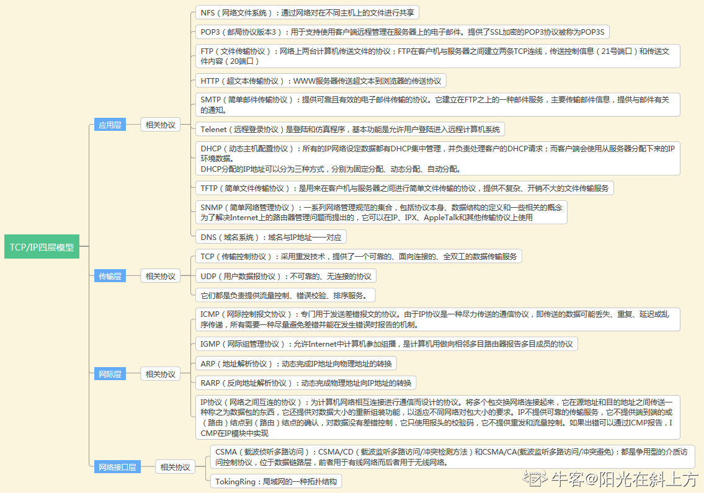

# 一、回顾内容

- 网络怎么连接的
- [牛客网计算机网络基础刷题](https://www.nowcoder.com/exam/intelligent?questionJobId=10&tagId=21000)
- Java对应的包以及netty

# 二、核心知识点

## 各层协议

# 三、刷题记录

- 2022/12/5
1. DNS的工作层次 & 端口号
2. Cookie的理解（根域和子域）
3. 各层次的协议情况

