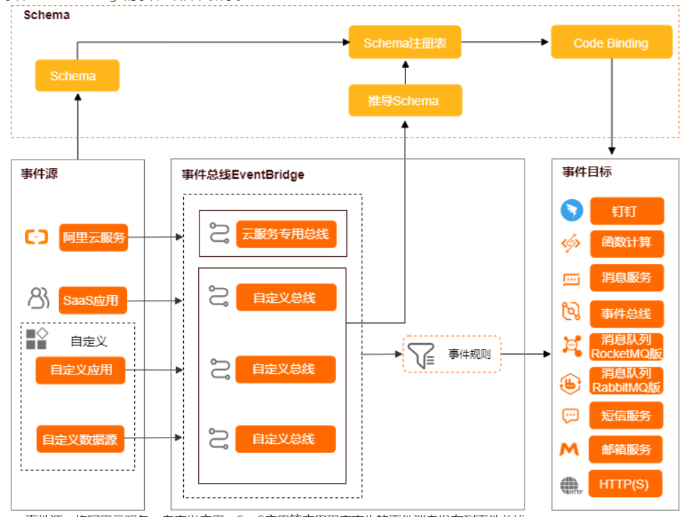

>官方学习链接：[官方地址](https://help.aliyun.com/product/161886.html)

# 一、产品介绍

事件总线EventBridge是阿里云提供的一款无服务器事件总线服务，支持阿里云服务、自定义应用、SaaS应用以标准化、中心化的方式接入，
并能够以标准化的`CloudEvents 1.0`协议在这些应用之间路由事件，帮助您轻松构建`松耦合、分布式`的`事件驱动架构`。

## 1. 核心概念
 
事件（-event,msg）：状态变化的数据记录。

事件源（source,producer,client-service/producer）：事件的来源，负责生产事件。

事件目标（target,consumer,client-service/consumer）：事件的处理终端，负责消费事件。

**事件总线（bus,brocker,server-register）**：事件的中转站，负责事件的中间转储。

**事件规则（rule,route）**：用于**监控**特定类型的事件。当发生匹配事件时，事件会被**路由**到与**事件规则关联的事件目标**。
观察-监控，分发路由
事件绑定目标--；而非事件源去绑定了；实现松耦合

## 2.应用场景
**构建事件驱动型架构**：借助事件总线EventBridge，您无需了解事件源，就可以直接筛选并发布事件。

**微服务解耦**：事件总线EventBridge可以实现不同系统之间的异步消息通信，从而将互相依赖的服务解耦。

**异步执行**：事件总线EventBridge可以使执行逻辑异步运行，减少用户的等待时间，增加系统的吞吐量。

**状态变化追踪**：事件总线EventBridge可以作为中心接收所有应用的状态变化，然后将这些应用状态变化分别路由到需要感知这些变化的服务。

## 3.产品功能

### 事件源

事件源是事件的来源，负责生产事件。事件总线EventBridge支持以下事件源：

- 阿里云官方事件源
事件总线EventBridge支持弹性计算类、存储类、数据库类以及容器和中间件类等丰富的阿里云官方事件源。

- 自定义事件源
自定义应用作为事件源，支持通过SDK接入。存量的消息数据作为事件源，支持通过配置事件提供方接入。
  
### 事件目标

事件目标是事件的处理终端，负责消费事件。事件总线EventBridge支持以下事件目标：

函数计算FC
消息队列RocketMQ
消息队列RabbitMQ
消息服务MNS
HTTP网关
HTTPS网关
短信服务
邮件推送
钉钉
云数据库RDS MySQL版
自建MySQL数据库

### 注册表

Schema注册表用于存储事件的Schema，通过访问Schema注册表，您可以轻松获取事件体的数据格式。您还可以从Schema注册表中下载事件Schema的Code Binding，快速访问事件。事件总线EventBridge包含以下两种Schema注册表：

云产品事件注册表：每个云产品官方事件源的事件类型对应一个Schema。例如ECS删除快照事件，就有一个Schema和该事件对应。
自定义注册表：需要您自行管理的注册表，用于管理自定义应用或者存量消息数据的Schema。

### 事件处理

事件总线EventBridge提供以下事件处理能力：
传输事件
过滤事件
路由事件（rule绑定推送）
重试事件

**发布事件（JDK--）**

**查询事件（控制查看）**

# 二、入门使用

## 1.开通EB服务

使用事件总线EventBridge前，您需在产品页开通该服务。本文介绍如何开通事件总线EventBridge。
如果您的账号为RAM用户，必须让阿里云账号为RAM用户进行授权，才能通过**控制台或API**访问相应的
事件总线EventBridge资源，并使用资源通过**SDK路由事件**。

## 2.接入官方事件源

- 定义规则--路由（配置规则时，确定事件源，进行绑定目标）

在配置基本信息配置向导，在名称文本框输入规则名称，在描述文本框输入规则的描述，然后单击下一步。
在配置事件模式配置向导，**事件源类型选择阿里云官方事件源**，事件源选择acs.ecs云服务器，事件类型选择ecs:Snapshot:CreateSnapshotCompleted创建快照完成，在事件模式内容代码框输入事件模式，然后单击下一步。
在配置事件目标配置向导，配置目标服务，然后单击创建。
说明 **1个事件规则最多可以添加5个目标**。
服务类型：单击消息服务。
队列：选择已创建的队列。
消息内容：单击完整事件。

