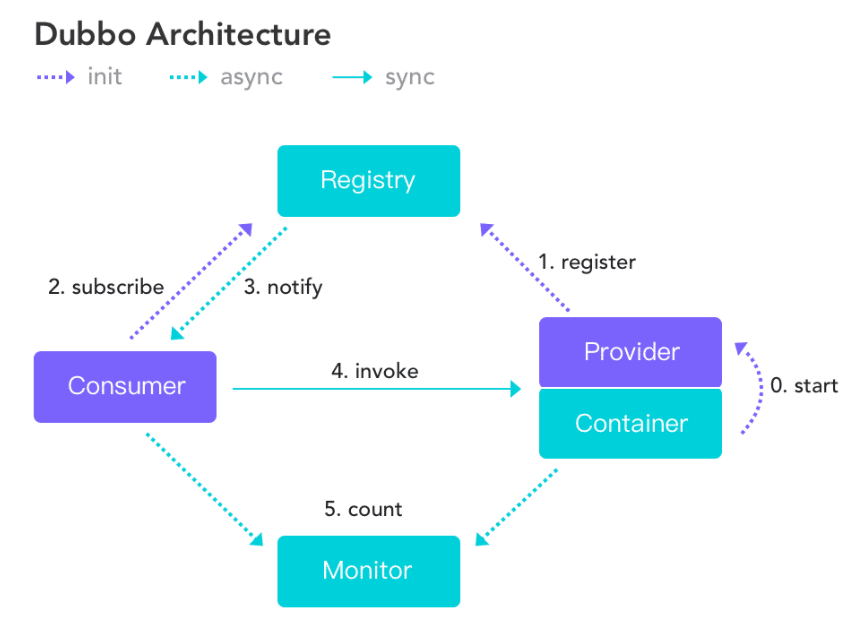

## 一、基础概念

[详情参考官方文档](https://dubbo.incubator.apache.org/zh/overview/what/overview/)

1. 什么是Dubbo

>简述：Apache Dubbo 是一款 RPC 微服务框架. 目前3.0版本，采用triple协议实现RPC，兼容grpc。

RPC:远程调用框架，调用远程的服务就像本地一样。常见的有grpc,dubbo.

关键点: server(服务注册中心--nacos,zk)、client(提供者和消费者)

> Apache Dubbo 是一款 RPC 服务开发框架，用于解决微服务架构下的**服务治理与通信问题**，官方提供了 Java、Golang 等多语言 SDK 实现。使用 Dubbo 开发的微服务原生具备相互之间的远程地址发现与通信能力， 利用 Dubbo 提供的丰富服务治理特性，可以实现诸如**服务发现、负载均衡、流量调度**等服务治理诉求。Dubbo 被设计为高度可扩展，用户可以方便的实现**流量拦截、选址的各种定制**逻辑。

2. 基本特点

3. 基本流程

Java stub:服务代理-定义服务标准（interface、protobuf idl指定）

Impl:实现标准，Provider 服务端，提供者 提供该服务的实现

## 二、入门实践
